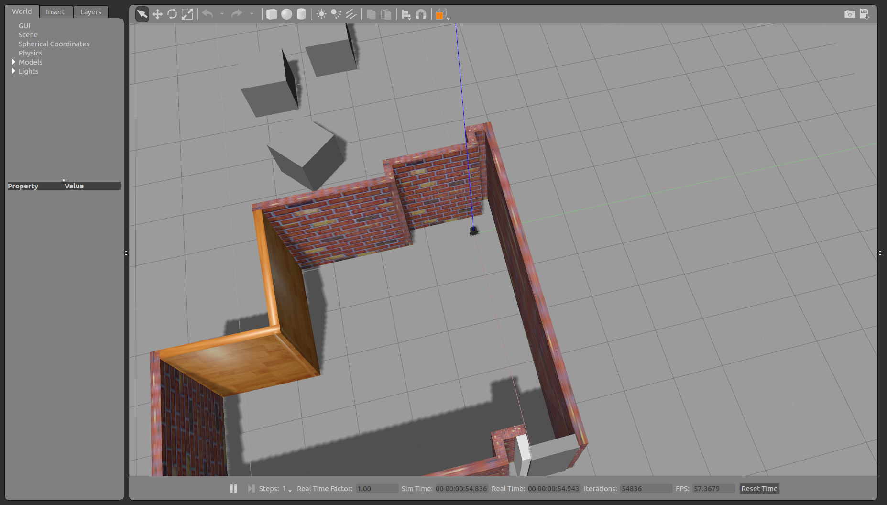

# Proyecto_de_grado
Desarrollo de algoritmo de evasion de obstáculos con un robot móvil.

Obstacle avoidance algorithm with a mobile robot and deep reinforcement learning.

how to use:

- Set up conda environment. Install anaconda and install the [rquirements.txt](./src/requirements.txt) with:

```
pip install -r requirements.txt
```

On a terminal, spawn the environment with:

```
roslaunch proyecto_de_grado spawn_burger.launch
```

and add three cubes to the world. You migth see something like this:



then, launch the algoritm with

```
roslaunch proyecto_de_grado tb3_dqn_ob1.launch tipo:=n
```

where n could be a number from 0 to 3.

you should see something like this [video](https://youtu.be/ZLXPdsSs0Kw?t=7)
